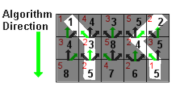

# **Seam Carve Image Compressor**
This program is a Seam Carve Image Compressor made with Java based on a [cs61b homework](https://sp18.datastructur.es/materials/hw/hw5/hw5) at UC Berkeley.
**Note:** This program needs to set up [Java programming environment](https://algs4.cs.princeton.edu/code/) provided by Princeton University for the GUI part.


## **Features:**
Seam-carving is a content-aware image resizing technique where the image is reduced in size by one pixel of height (or width) at a time with least image quality loss. A vertical seam in an image is a path of pixels connected from the top to the bottom with one pixel in each row. (A horizontal seam is a path of pixels connected from the left to the right with one pixel in each column.) Below is the original 505-by-287 pixel image; further below we see the result after removing 150 vertical seams, resulting in a 30% narrower image. Unlike standard content-agnostic resizing techniques (e.g. cropping and scaling), the most interesting features (aspect ratio, set of objects present, etc.) of the image are preserved.


## **Implementation overview**
This compressor uses **shortest path algorithm** in graph theory to compress the image at the same time bring as less as possible influnce to the image. The following is the introduction to its implemention.

### **Image notation**
 In image processing, pixel $(x, y)$ refers to the pixel in column x and row y, with pixel $(0, 0)$ at the upper left corner and pixel $(W − 1, H − 1)$ at the bottom right corner. This is consistent with the Picture data type in stdlib.jar. Warning: this is the opposite of the standard mathematical notation used in linear algebra where $(i, j)$ refers to row i and column j and with Cartesian coordinates where $(0, 0)$ is at the lower left corner.
 
 **a 3-by-4 image**


||||
| ----------- | ----------- | ----------- |
| (0, 0)      | (1, 0)      | (2, 0)      |
| (0, 1)      | (1, 1)      | (2, 1)      |
|  (0, 2)     |   (1, 2)    | (2, 2)      |
| (0, 3)  	  |  (1, 3)     |  (2, 3)     |

We also assume that the color of a pixel is represented in RGB space, using three integers between 0 and 255. This is consistent with the `java.awt.Color` data type.
We use `edu.princeton.cs.algs4.Picture` provided in the Library to represent the image.

### **Energy calculation**
The first step is to calculate the energy of each pixel, which is a measure of the importance of each pixel—the higher the energy, the less likely that the pixel will be included as part of a seam (as we’ll see in the next step). In this assignment, you will implement the dual gradient energy function, which is described below. Here is the dual gradient of the surfing image above:


A high-energy pixel corresponds to a pixel where there is a sudden change in color (such as the boundary between the sea and sky or the boundary between the surfer on the left and the ocean behind him). In the image above, pixels with higher energy values have whiter values. The seam-carving technique avoids removing such high-energy pixels.

The implementation of Computing the Energy of a Pixel is implemented by in SeamCarver.energy()
We will use the dual gradient energy function: The energy of pixel (x, y) is $Δ^2_x(x,y)+Δ^2_y(x,y)$, where the square of the x-gradient $Δ^2_x(x,y)=R_x(x,y)^2+G_x(x,y)^2+B_x(x,y)^2$,  and where the central differences $R_x(x,y)$, $G_x(x,y)$, and $B_x(x,y)$ are the absolute value in differences of red, green, and blue components between pixel $(x + 1, y)$ and pixel $(x − 1, y)$. The square of the y-gradient $Δ^2_y(x,y)$ is defined in an analogous manner. We define the energy of pixels at the border of the image to use the same pixels but to replace the non-existant pixel with the pixel from the opposite edge.

### **Seam identification**
The next step is to find a vertical seam of minimum total energy. This is similar to the classic shortest path problem in an edge-weighted digraph except for the following:
- The weights are on the vertices instead of the edges.
- We want to find the shortest path from any of W pixels in the top row to any of the W pixels in the bottom row.
- The weights are on the vertices instead of the edges.

We implements Seam identification in `SeamCarver.findVerticalSeam()` and `SeamCarver.findHorizontalSeam()`. To reduce the redundancy the latter `transpose()` the image then call the find former method, so we will just explain the former.

The `findVerticalSeam()` method  returns an array of length H such that entry x is the column number of the pixel to be removed from row x of the image.

The `findVerticalSeam` method works by first solving a base case subproblem, and then using the results of previous subproblems to solve later subproblems. Suppose we have the following definitions:

- $M(i,j)$ - cost of minimum cost path ending at $(i, j)$
- $e(i,j)$ - energy cost of pixel at location $(i, j)$

Then each subproblem is the calculation of $M(i,j)$ for some $i$ and $j$. The top row is trivial, $M(i,0)$ is just $e(i,0)$ for all $i$. For lower rows, we can find $M(i,j)$ simply by adding the $e(i,j)$ to the minimum cost path ending at its top left, top middle, and top right pixels, or more formally: $M(i,j)=e(i,j)+min(M(i−1,j−1),M(i,j−1),M(i+1,j−1))$

In short, we start from one side of the 2D image array and process row-by-row or column-by-column (for vertical and horizontal seam carving respectively).



### **Seam Removal**
The final step is remove from the image all of the pixels along the seam. The logic for this method has been implemented for you in the supplementary SeamRemover class, provided in `SeamRemover.java`.

## **Running the Compressor**
To start an Compressor, first build the project in Intellij IDEA.

`SeamCarverVisualizer` class is used for the purposes of visualizing the frame-by-frame actions of the compressor, which takes three command line arguments: `[filename] [numPixels to remove] [axis of remove]`. 

`filename` is used to identify which picture to compress. `numPixels` to remove is the number of pixels you want to remove, the greater the value is, the picture will be smaller and more indistinguishable. `axis of remove` can only be the value `x`, `y` or `xy`, which determines the direction of compression

In IntelliJ, set the command line arguments up using the Edit. For example, you can set it as:

```
images\miku.png 100 xy
```
Then run the program, you can see the image `miku.png` was compressed on both `x` and `y` axis of 100 pixels.

Or if you’re using the command line you’d run the command as follows:
```
java SeamCarverVisualizer [filename] [numPixels to remove] [axis of remove]
```
Here is a demo of the picture and compression process above:


Then the result of the compress will be automatically store as `./output.png`.

## **Files:**
Here are all the files that were included in the repository:
- `PrintEnergy.java`: For printing the energy calculations per pixel for an input image.
- `PrintSeams.java`: Prints the energies and computed horizontal and vertical seams for an input image.
- `ShowEnergy.java`: Shows the grayscale image corresponding to the energy computed by pixel.
- `ShowSeams.java`: Displays the vertical and horizontal minimum energy seams for a given image.
- `SanityCheckTest.java`: Basic JUnit tests consisting of the energy and path examples given in this spec.
- `SanityCheckTest.java:` Basic JUnit tests consisting of the energy and path examples given in this spec.
- `SeamRemover.java`: Contains a SeamRemover class file with `removeHorizontalSeam()` and `removeVerticalSeam()` methods to use in your SeamCarver.
- `SeamCarverVisualizer.java`: For the purposes of visualizing the frame-by-frame actions of your SeamCarver, we’ve provided you with a `SeamCarverVisualizer` class which takes three command line arguments: `[filename] [numPixels to remove] [axis of remove]`
- `images`: images used for demo.

