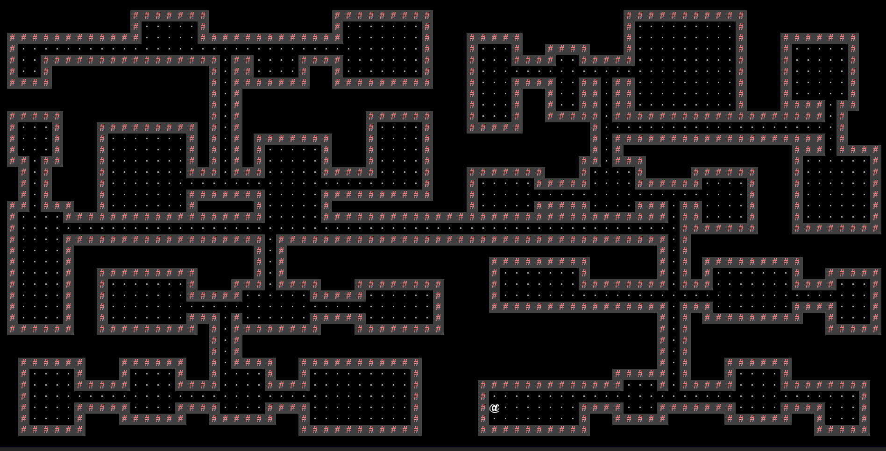

# **Random World Generation Game Engine**
This program is a randomize world generation game engine made with Java. It based on a course project of cs61b project at UC Berkeley.

## **Features:**
This game engine can random generate a 2D tile-based game map according to a given `seed`. The game map contains room of different sizes and hallways that connect them. Then you will have a 1*1 2D tile as your avatar and you can control it to explore and interact with the world. Also, this game implements Save and Load feature that allows it to be saved and resumed at the exact point where the player save the game.

### **Seed**
A seed it an `unsigned int` number (range from `0` up to `9,223,372,036,854,775,807`) that we used to generate the world. You will be prompted to enter it by keyboard when you start the game. The gameworld is deterministic once the seed been entered, which means that there is a one-to-one correspondence between the seed and the gameworld it generates.

### **Random World Generation**
The world is pseudorandomly generated 2D grid, drawn using the tile engine provided by cs61b course. The world contains a random number of rooms and hallways at random locations. The rooms are of rectangular shapes with a wall divide the inside and outside of the room, which have random length and width The hallways are passages with width `1` and walls on both sides, which are used to connect two different rooms.

### **Interactivity**
The world is explorable which means that you will have an avatar in the game and you can control it with your keyboard to interact with the world. You can walk inside the rooms and walk through the hallways.

### **Save and Load**
You can save the game, which will save the full game condition to a file. The data will not be lost if you exit the program. Then next time when you start, you will be provided by an option to load the game you saved.

## **Play the game**
Compile the project and run `byog/Core/Main.java` to start the game. Then you will see three choices:

Press the corresponding letter to continue. For example, if you want to start a new game, please press `N`.
Then you will be prompted to enter the seed (The seed must be a unsigned integer number):

After entering the seed, press `S` to start the game. The following is the world generated by the seed `0`.

Then you can start to intereact with the game, press `W`, `S`, `A`, `D` to go up, down, left, right respectively.

To save the game, you can press `:` and then `Q`. Then you will save and quit the game. To load the game, start the game again and press `L`.

## **Files**
Here are all the files that were included in the repository:
- `byog`: project source code
  - `Core`: core of the game
    - `Object`: game objects, including the room and hallway and other object used in the game
      - `GameObject.java`: an interface specifies the APIs of the game objects
      - `RectangularObject.java`: an abstract class specifies the APIs of rectangular game objects
      - `RectangularSize.java`: size of rectangular objects
      - `Dungeon.java`: implements the random generation algorithm, dividing itself to generate smaller room and finally generate rooms and hallways that connect them
      - `MainDungeon.java`: the biggest Dungeon, has the same size of the game map
      - `Room.java`: implements the player
      - `Player.java`: implements the player
      - `NumberGenerator.java`: generate random numbers
      - `Range.java`: generate a range object like Python, used to simplify the code
      - `TestGameObject.java`: test for the game objects
    - `Game.java`: implement game status and game interactivity
    - `Index.java`: implement index of objects
    - `Main.java`: be used to start the game
    - `RandomUtils.java`: A random generator
    - `SaveAndLoad.java`: implements save and load
    - `StringGame.java`: implements play game with string, which is used to test the game
    - `StringInputHandling.java`: be used to handling the string input
    - `TestInputHandling.java`: tests for input handling
    - `WorldGenerator.java`: be used to generate the game world
  - `lab5`: UCB lab file
  - `lab6`: UCB lab file
  - `SaveDemo`: save demo provided by UCB
  - `TileEngine`: used to render the image from tile level to pixel level.
- `image`: images used for indroduction
- `gameWorld.txt`: save data file.
- `.idea`: files generated by Intellij IDEA
- `META-INF`: Meta infomation generated by Intellij IDEA
- `out`: output files generated by Intellij IDEA
- `procedural generation - Algorithm for procedureral 2D map with connected paths - Game Development Stack Exchange.pdf`: reference for the random generalize algorithm
- `proj2.iml`: project information file generated by Intellij IDEA
## **Implementation overview**
Here is a brief overview of the **Random World Generation** in our game. 
The random generalization procedure is implemented by the **divide-and-conquer** strategy.
- First, initialize the random `NumberGenerator` implemented in `NumberGenerator.java` with the `seed`.
- Next, substantiate the `MainDungeon` with a `RectangularSize`. The `RectangularSize` has `length` and `width` same as the game map, which are predetermined in `Game.java` as `WIDTH` and `HEIGHT`.
- Then, the `MainDungeon` will `divide()` into 2 `subDungeons` in an arbitrary direction during its substantiation. The `subDungeons` are of type `Dungeon`. Then the `subDungeons` will recursively `divide()` and create `subDungeons`.
- The `MainDungeon` will `divide()` into 2 `subDungeons` in an arbitrary direction during its substantiation. The `subDungeons` are of type `Dungeon`. Then the `subDungeons` will recursively `divide()` and create `subDungeons`, which create a tree structure of `Dungeon` with `MainDungeon` as the root.
- The `Dungeon` will stop `divide()` until its `length` and `width` reaches a predetermined `MAX_DUNGEON_LENGTH`. We call such `Dungeon` a `BasicDungeon` and they are the leaves of "`Dungeon`-tree". Then the `MainDungeon` will **postorderly traverse** the “`Dungeon`-tree” to `addRoomsAndHallways()`, which means it will first `addRooms()` to the two `subDungeons` (if they are `BasicDungeon`,  `addRooms()` to it. If not, `addRooms()` to its `subDungeons`), and the `addHallways()` to connect them. The `width` and `height `of each Room must be larger than half of size of `basicDungeon` they are in. So that there will a straight `Hallway` to connect them.
- We have finish randomly generate the game world. Finally, `getRandomRoom()` and add a `Player` to the corner of it. Then we can start our interactive play session.
