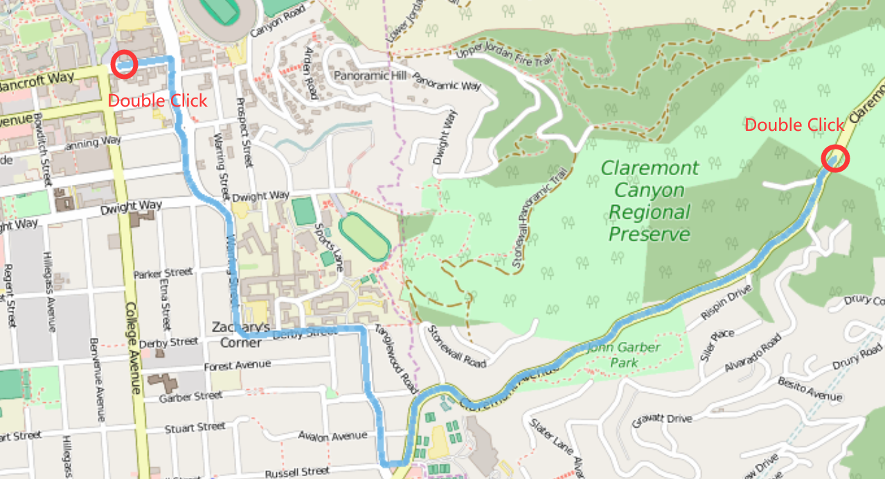
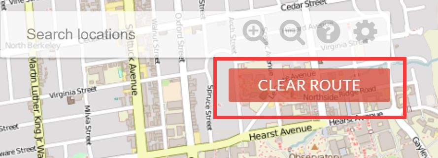
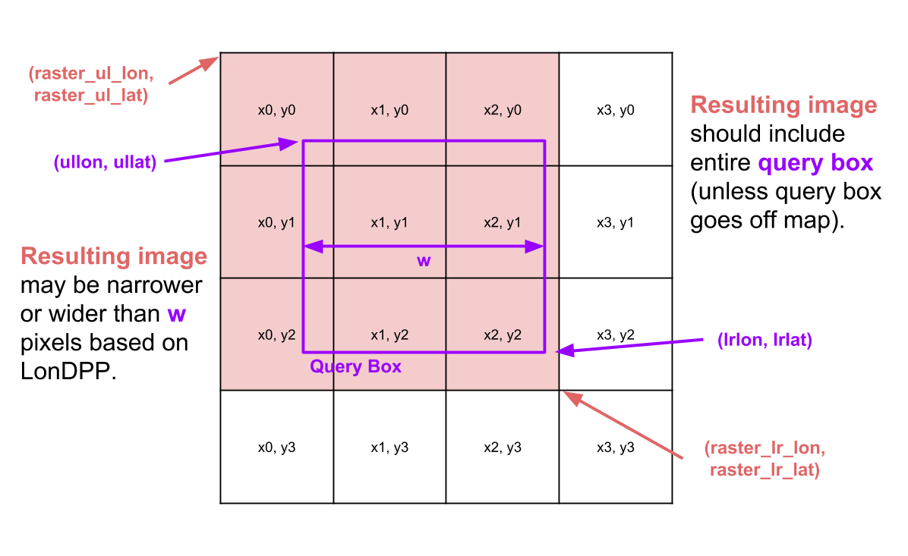

# **Bear Map**
This program is a Map of the City Berkeley made mainly made with Java.

## **Files:**
Here are all the files that were included in the repository:
- `src`: source code folder
    - `main\java`: Backend Java source files
        - `example`: Comprehensive examples
        - `GraphBuildingHandler.java`: Tools used for `GraphDB`
        - `GraphDB.java`: Build map data files as a graph
        - `GraphDBLauncher.java`: The launcher for `GraphDB`
        - `MapServer.java`: Main map server, run this to start the map
        - `Rasterer.java`: Used to raster and display images.
        - `Router.java`: Implements the Router for route search with A* Algorithm
    - `static\page`: Frontend page files
    - `test\java`: Backend test files 
- `images`: Images used for introdcution
- `target`: Intellij IDEA project files
- `berkeley.osm`: test data file
- `berkeley-cs.xml`: test data file
- `directions_results.txt`: test data file
- `path_params.txt`: test data file
- `path_results.txt`: test data file
- `pom.xml`: test data file
- `proj3.iml`: Intellij IDEA project files
- `raster_params.txt`: test data file
- `raster_results`: test data file
- `test.html`: front end test page
- `test1234.html`: front end test page
- `testTwelveImages.html`: front end test page

## **Features:**
This Map implements features of Images Rastering, Route Search, Navigation, Autocompletion and Search. Here are the details of these features:

### **Map Rastering**
The map will render and display the most appropriate image on the user interface, which allows users to zoom in and zoom out and maintain the highest image resolution and details.


### **Route Search and Navigation**
This software implements route search to find the shortest path between two point specified by the user with A* algorithm.


 Also, the software also implements navigation, which will give you a set of instructions to tell you which way and how long to go and which direction to take turns.

 

### **Search and Autocompletion**
The map also implements Search and Autocompletion. You can search for places on the map with their names, then the map will mark the place you request with red signs.

 When you search, the software help you autocomplete the request by providing you a list of names in the map the corresponding to the prefix you typed. 
 

## **User Manual**
### **Start the program**
Build the project, run `MapServer.java` and navigate your browser (Chrome preferred; errors in other browsers will not be supported) to `localhost:4567`. This should load up `map.html`; “404 Not found” error, you can open `src/static/page/map.html` manually by right clicking and going to Open In Browser in IntelliJ. Once you’ve opened map.html, you should see something like the window below:


### **Zoom in and Zoom out**
Use the `+` and `-` buttons on the upper-left conner of the UI to zoom in and zoom out


### **Change the theme**
Left click on the `setting` button on the upper-left conner of the UI then you can change theme on the pop-up setting window to choose between the four themes.


### **Search**
Left click on the `search bar` on the upper-left conner, then type whatever you want you search. Then the names of the locations match the prefix you typed will appear below the search bar. 

Left click on one name, then the location you request will be marked on the map with a red pin.


### **Route finding and Navigation**
Start route finding by double clicking on the place to start on the map to mark the starting point. Then choose the destination map and double click it again. The shortest route between them will instantly appear on the map and will marked with blue line.


If you want to see the navigation instructions, left click on the button on the upper-right of the UI.


You can click `CLEAR ROUTE` button on the upper-left of the UI to clear the path.


## **Implementation overview**

### **Map Rastering**
Rastering is the job of converting information into a pixel-by-pixel image. In the `Rasterer` class you will take a user’s desired viewing rectangle and generate an image for them.

The user’s desired input will be provided to you as a `Map<String, Double>` params, and the main goal of your rastering code will be to create a `String[][]` that corresponds to the files that should be displayed in response to this query.

As a specific example (given as “testTwelveImages.html” in the skeleton files), the user might specify that they want the following information:

```
{lrlon=-122.2104604264636, ullon=-122.30410170759153, w=1085.0, h=566.0, ullat=37.870213571328854, lrlat=37.8318576119893}
```
This means that the user wants the area of earth delineated by the rectangle between longitudes **-122.2104604264636** and **-122.30410170759153** and latitudes **37.870213571328854** and **37.8318576119893**, and that they’d like them displayed in a window roughly **1085 x 566** pixels in size (width x height). We call the user’s desired display location on earth the **query box**.

To display the requested information, the software uses  street map pictures, which are stored in `library-sp18`. All of the images provided are 256 x 256 pixels. Each image is at various levels of zoom. For example, the file `d0_x0_y0.png` is the entire map, and covers the entire region. The files `d1_x0_y0.png`, `d1_x0_y1.png`, `d1_x1_y0.png`, and `d1_x1_y1.png` are also the entire map, but at double the resolution, i.e. `d1_x0_y0` is the northwest corner of the map, `d1_x1_y0` is the northeast corner, `d1_x0_y1` is the southwest corner, and `d1_x1_y1` is the southeast corner.

More generally, at the Dth level of zoom, there are 4^D images, with names ranging from `dD_x0_y0` to `dD_xk_yk`, where k is 2^D - 1. As x increases from 0 to k, we move eastwards, and as y increases from 0 to k, we move southwards.

The job of the rasterer class is decide, given a user’s query, which files to serve up. For the example above, your code should return the following 2D array of strings:

```
[[d2_x0_y1.png, d2_x1_y1.png, d2_x2_y1.png, d2_x3_y1.png,
[d2_x0_y2.png, d2_x1_y2.png, d2_x2_y2.png, d2_x3_y2.png],
[d2_x0_y3.png, d2_x1_y3.png, d2_x2_y3.png, d2_x3_y3.png]]
```

This means that the browser should display `d2_x0_y1.png` in the top left, then `d2_x1_y1.png` to the right of `d2_x0_y1.png`, and so forth. Thus our “rastered” image is actually a combination of 12 images arranged in 3 rows of 4 images each.

The `MapServer` code will take the 2D array of strings and display the appropriate image in the browser. 

To rigorously determine which images to use, we will define the longitudinal distance per pixel (LonDPP) as follows: Given a query box or image, the LonDPP of that box or image is

$LonDPP = \frac {lower\,right\,longitude\,−\,upper\,left\,longitude} {width\,of\,the\,image\,(or\,box)\,in\,pixels}$

For example, for the query box in the example in this section, the LonDPP is $(-122.2104604264636 + 122.30410170759153) / (1085)$ or $0.00008630532$ units of longitude per pixel. At Berkeley’s latitude, this is very roughly 25 feet of distance per pixel.

Note that the longitudinal (horizontal) distance per pixel is not the same as the latidudinal (vertical) distance per pixel. This is because the earth is curved. If you use latDPP, you will have incorrect results.

The images that you return as a `String[][]` when rastering must be those that:

- Include any region of the query box.
- Have the greatest LonDPP that is less than or equal to the LonDPP of the query box (as zoomed out as possible). If the requested LonDPP is less than what is available in the data files, you should use the lowest LonDPP available instead (i.e. depth 7 images).

For image depth 1 (e.g. `d1_x0_y0`), every tile has LonDPP equal to 0.000171661376953125 which is greater than the LonDPP of the query box, and is thus unusable. This makes intuitive sense: If the user wants an image which covers roughly 25 feet per pixel, we shouldn’t use an image that covers ~50 feet per pixel because the resolution is too poor. For image depth 2 (e.g. `d2_x0_y1`), the LonDPP is 0.0000858306884765625, which is better (i.e. smaller) than the user requested, so this is fine to use. For depth 3 tiles (e.g.` d3_x0_y2.png`), the LonDPP is 0.00004291534423828125. This is also smaller than the desired LonDPP, but using it is overkill since depth 2 tiles (e.g. `d2_x0_y1`) are already good enough. In my head, I find it useful to think of LonDPP as “blurriness”, i.e. the `d0` image is the blurriest (most zoomed out/highest LonDPP), and the `d7` images are the sharpest (most zoomed in, lowest LonDPP).

As an example of an intersection query, consider the image below, which summarizes key parameter names and concepts. In this example search, the query box intersects 9 of the 16 tiles at depth 2.


### **Building graph acroding to Data**
Routing and location data is provided in the `berkeley.osm` file. This is a subset of the full planet’s routing and location data, pulled from [here](http://download.bbbike.org/osm/). The data is presented in the OSM [XML file format](http://wiki.openstreetmap.org/wiki/OSM_XML).

XML is a markup language for encoding data in a document. Open up the `berkeley.osm` file for an example of how it looks. Each element looks like an HTML tag, but for the OSM XML format, the content enclosed is (optionally), more elements. Each element has attributes, which give information about that element, and sub-elements, which can give additional information and whose name tell you what kind of information is given.

The first step is to build a graph representation of the contents of berkeley.osm. We have chosen to use a SAX parser, which is an “event-driven online algorithm for parsing XML documents”. It works by iterating through the elements of the XML file. At the beginning and end of each element, it calls the `startElement` and `endElement` callback methods with the appropriate parameters.

### **Route Search**
The `/route` endpoint (kinda like a method in web programming) receives four values for input: the start point’s longitude and latitude, and the end point’s longitude and latitude. Implement `shortestPath` in the `Router` class so that it satisfies the requirements in the Javadoc.

The route is the shortest path that starts from the closest connected node to the start point and ends at the closest connected node to the endpoint. Distance between two nodes is defined as `the great-circle distance` between their two points (lon1, lat1) and (lon2, lat2). The length of a path is the sum of the distances between the ordered nodes on the path. We do not take into account driving time (speed limits).

The routing algorithm takes into account the fact that latitude and longitude are in slightly different scales (at our latitude, 1 degree of latitude is 364,000 feet and 1 degree of longitude is 288,000 feet), and also takes into account that as you move north or south, these two scales change slightly. We created a `distance` method for you that you can use that automatically computes the distance.

#### **Runtime & A***
In this program, we use A* search two find the shortest path between two points. It works as follows:

Let `n` be some node on the search fringe (a min priority queue), `s` be the start node, and t be the destination node. A* differs from Dijkstra’s in that it uses a heuristic `h(n)` for each node `n` that tells us how close it is to `t`. The priority associated with `n` should be `f(n) = g(n) + h(n)`, where `g(n)` is the shortest known path distance from `s` and `h(n)` is the heuristic distance, the great-circle distance from `n` to `t`, and thus the value of `h(n)` should shrink as `n` gets closer to `t`. This helps prevent Dijkstra’s from exploring too far in the wrong direction.

#### **Turn-by-turn Navigation**
As another feature, we use your A* search route to generate a sequence of navigation instructions that the server will then be able to display when you create a route. To do this, we implemented the method `routeDirections` in your `Router` class. This part of the project is not worth any points (even gold points), but it is awfully cool.

How we will represent these navigation directions will be with the `NavigationDirection` object defined within `Router.java`. A direction will follow the format of “DIRECTION on WAY for DISTANCE miles”. Note that DIRECTION is an `int` that will correspond to a defined `String` direction in the `directions` map, which has 8 possible options:
- “Start”
- “Continue straight”
- “Slight left/right”
- “Turn left/right”
- “Sharp left/right”

To minimize the amount of String matching  pass between the data, we have formatted the representation, which simpl set the correct `DIRECTION`, `WAY`, and `DISTANCE `values for the given direction you want when creating a `NavigationDirection`. Specifically, the direction will depend on the relative bearing between the previous node and the current node, and should be as followed:

- Between -15 and 15 degrees the direction should be “Continue straight”.
- Beyond -15 and 15 degrees but between -30 and 30 degrees the direction should be “Slight left/right”.
- Beyond -30 and 30 degrees but between -100 and 100 degrees the direction should be “Turn left/right”.
- Beyond -100 and 100 degrees the direction should be “Sharp left/right”.

### **Autocompletion and Search**
Autocompletion and Search is done by building the data structure `TRIE` tree. It iterate through all the names in of the locations, clean them (to lower case and contains on characters frome a to z) and put them into a `TrieSet`.
#### **Autocompletion**
When the user types in the prefix, the method `getAllOriginalNames` will get from the `TrieSet` of all originals names corresponding to the prefix.

 For the runtime of the search. Assuming that the lengths of the names are bounded by some constant, querying for prefix of length `s` should take `O(k)` time where `k` is the number of words sharing the prefix.

#### **Search**
Mathod `getLocations` collects a `List` of `Maps` containing information about the matching locations - that is, locations whose cleaned name match the cleaned query string exactly. This is not a unique list and should contain duplicates if multiple locations share the same name (i.e. Top Dog, Bongo Burger).
Suppose there are `k` results. The query runs in `O(k)`.
 


